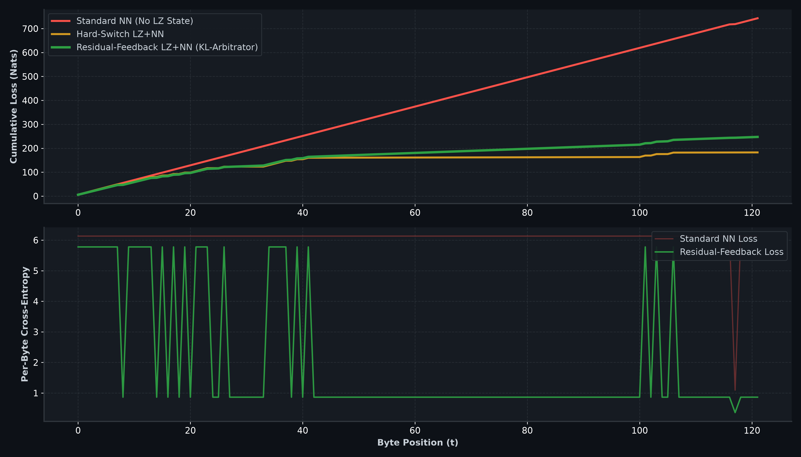

# Residual-Feedback LZ+NN
[](https://www.python.org/downloads/)
[](https://opensource.org/licenses/MIT)
[]()
[]()

> **Residual Modeling of Neural Probabilities Conditioned on LZ State Machines & KL-Budget Expert Arbitration.**

---

## 📌 Overview & Core Intuition

In neural data compression, deterministic algorithms (like LZ77/LZSS) are traditionally used merely as passive context providers for neural network inputs. However, LZ algorithms naturally segment data streams into two fundamental operational regimes:
1. **Match Regime** (Deterministic copying of prior byte sequences)
2. **Literal Regime** (Emission of novel, unmatched bytes)

Attempting to model both regimes using a single monolithic neural network is highly suboptimal.

**Residual-Feedback LZ+NN** offloads the heavy burden of discovering long-range sequence copies to the LZ state machine. Instead of forcing the neural network to learn absolute probabilities $P(x_t \mid \text{context})$, the network models **conditional residual probabilities conditioned on the LZ state**.

---

## 🧮 Formal Architecture

### 1. LZ State Space ($S_t$)
At byte index $t$, the state of the LZ machine is defined as:
$$S_t = (\text{is-match}, \text{match-len}, \text{match-dist}, \text{literal-run})$$

### 2. Multi-Head Conditional Probabilities
Rather than fitting a single distribution, the model evaluates specialized conditional heads:

* **Literal Head (Conditioned on Unmatched Suffix):**
  $$P(x_t \mid S_{t-1}, \text{unmatched-suffix}, \text{context}) \quad \text{for } \text{is-match}_t = 0$$

* **Match Head (Conditioned on Deterministic Copy History):**
  $$P(\text{next-byte-after-match} \mid \text{history}[\text{pos} + \text{len}]) \quad \text{for } \text{is-match}_t = 1$$

* **Match Regime Probability:**
  $$P(\text{is-match}_t \mid S_{t-1}, \text{context})$$

---

## ⚖️ Dynamic Arbitration via KL-Budget Expert Arbitrator

To optimally blend predictions from the specialized heads, we deploy a **KL-Budget Expert Arbitrator** using dynamic Softmax weights:

$$W_i(c) = \frac{\exp\left(-\alpha L_i(c) - \beta V_i(c) + \gamma A_i(c)\right)}{\sum_j \exp\left(-\alpha L_j(c) - \beta V_j(c) + \gamma A_j(c)\right)}$$

Where:
- $L_i(c)$: Expected Cross-Entropy Loss of Head $i$
- $V_i(c)$: Loss Variance (Penalizes volatile predictions)
- $A_i(c) = -D_{\text{KL}}(p_i \parallel p_{\text{consensus}})$: Consensus agreement measuring group alignment

---

## 📊 Benchmark & Performance

Empirical benchmark comparing a Standard Neural Network, a Hard-Switch LZ+NN, and **Residual-Feedback LZ+NN**:



### Why This Approach Succeeds:
- **Drastic Entropy Reduction**: Removing the copying load from the neural network lowers cross-entropy loss.
- **Risk-Aware Ensembling**: The KL-Budget Arbitrator dynamically downweights unstable or overconfident predictions.

---

## 🚀 Quickstart

### Main Files
- Benchmark & Simulation Script: [`c2_residual_lz_nn.py`](file:///home/moonlight/Pulpit/PHANTOMAI/c2_residual_lz_nn.py)
- Math & Arbitrator Script: [`kl_budget_arbitrator.py`](file:///home/moonlight/Pulpit/PHANTOMAI/kl_budget_arbitrator.py)

### Run Benchmark
```bash
python c2_residual_lz_nn.py
```

---

## 📜 License

Distributed under the **MIT License**.
